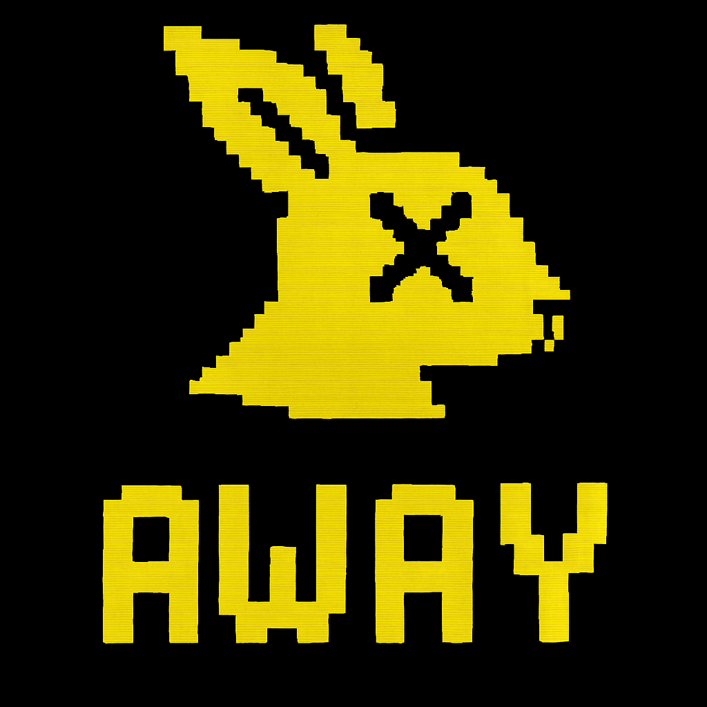
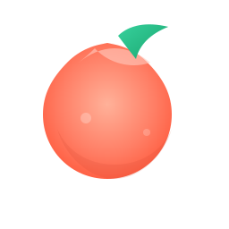

# <div align="center">
  

  <h1>DeadHop (Modern IRC + AI)</h1>

  <p>
    
    
    
    
  </p>

  <p>A modern, media‑rich IRC client for Windows with a toggleable <b>DeadHop AI</b> assistant.</p>
</div>

## 🚀 Quick start

1. Create a virtual environment (recommended) and install requirements.
2. Run the app.

```powershell
# 1) Create venv
python -m venv .venv
\.\.venv\Scripts\Activate.ps1

# 2) Install deps
pip install -r requirements.txt

# 3) Run
python -m app.main
```

## 🤖 AI Assistant (Local LLM via Ollama)

DeadHop can stream replies from a local LLM using [Ollama](https://ollama.com/). The client talks to Ollama's HTTP API at `http://127.0.0.1:11434` using `app/ai/ollama.py`.

### Setup

1) Install Ollama for Windows: https://ollama.com/download

2) Start the Ollama service (it usually auto-starts). If needed, run:

```powershell
ollama serve
```

3) Pull a model, e.g. Llama 3 8B:

```powershell
ollama pull llama3:8b
```

### Use in DeadHop

- Launch DeadHop and open the AI chat: Tools → Start AI Chat.
- Type your prompt; streaming responses should appear inline.

Notes:
- The helper `app/ai/ollama.py` checks availability via `/api/version` and streams tokens via `/api/generate`.
- Default endpoint is `127.0.0.1:11434`. Adjusting host/port requires code changes in `app/ai/ollama.py` for now.

### Troubleshooting

- If you see "AI not available" or timeouts:
  - Ensure Ollama is running: `http://127.0.0.1:11434/api/version` should return JSON in the browser.
  - Ensure the model is pulled: `ollama list`.
  - Try a smaller or quantized model if responses are slow.

## 📝 Notes
- First run creates a user config at `%USERPROFILE%/.peachbot_local/config.json`.
- The IRC engine and DeadHop AI are stubbed initially; we will iterate features quickly.

---

## ✨ Features Overview

- 🧭 **Multi-channel sidebar** with unread and highlight badges.
- 💬 **Private messages (PMs)** open as `[PM:nick]` entries.
- 👥 **Members list actions**: WHOIS, Query/PM, Add Friend, Kick, Ban, Op, Deop.
- ⭐ **Friends dock (Monitor)** to track nicks; persisted via QSettings.
- ⌨️ **Slash commands**: `/join`, `/part`, `/me`, `/nick`, `/msg`, `/query`, `/whois`, `/topic`, `/mode`, `/raw`.
- ⚡ **Local echo** for select commands for instant feedback.
- 🔗 **URL Grabber** collects links from chat.
- 🌐 **Built-in Browser** dock for web content.
- 🔔 **Notifications**: PMs, mentions, highlight words, joins/parts (configurable).
- 🧩 **Plugins** folder opener from Tools menu (auto-created).
- 🎨 **Theming** via qt-material when available.
- 🖼️ **Icon loading (filesystem-first)** from `app/resources/icons/custom/` with graceful fallback.

<p align="center">
  
  
  
</p>

## 📥 PM Behavior

- Opening a PM creates a sidebar entry labeled `[PM:nick]` and switches focus to it.
- You can open a PM via:
  - **Right-click → Query** on a member in the Members list.
  - **Double-click** a member in the Members list.
  - **Slash command** `/msg <nick> <message>` or `/query <nick> <message>`.

## ⌨️ Slash Commands

- `/me <action>` — Send CTCP ACTION to current target.
- `/join <#channel>` — Join a channel; locally echoes “Joined”.
- `/part [#channel]` — Leave channel (current if omitted); locally echoes “Left”.
- `/nick <newnick>` — Change your nickname.
- `/msg <target> <message>` — Send a message to target; opens `[PM:target]` for nicks.
- `/query <target> <message>` — Same as `/msg` but explicitly PM-oriented.
- `/whois <nick>` — WHOIS a user.
- `/topic [#chan] <topic>` — Set channel topic (uses current if `#chan` omitted).
- `/mode [#chan] <modes>` — Set channel modes (uses current if `#chan` omitted).
- `/raw <command>` — Send a raw IRC command.

## 🖱️ UI Interactions

- **Members list**
  - Right-click a nick for actions (WHOIS, Query/PM, Add Friend, Kick/Ban/Op/Deop).
  - Double-click a nick to start a PM (Query).
- **Friends dock**
  - Shows your monitored nicks; add via member context menu “Add Friend”.
- **Tools → Notifications → Configure…**
  - Toggle notifications: PM, mentions, highlight words, joins/parts.
- **Tools → Plugins…**
  - Opens `app/plugins/` (created if missing) in your file explorer.

## ⌨️ Keyboard Shortcuts

- Standard app quit: `Ctrl+Q` (platform default via QKeySequence.Quit)
- Find panel toggle: via menu (Find) — additional shortcuts can be added in `MainWindow._build_menus()`.

## 🗂️ Paths and Icons

- Icons are loaded from `app/resources/icons/custom/` first using helpers `get_icon()` / `_icon_from_fs()`.
- Window icon preference: `main app pixels.(svg|png)` under the custom icons folder; fallback to `app/resources/icons/deadhop.svg` (then legacy `peach.svg` if missing).

## 💾 Persistence

- Settings use `QSettings("DeadHop", "DeadHopClient")` for theme, wrap, timestamps, geometry, servers, friends, and notification prefs.

## 🛠️ Development

- Main window: `app/ui_pyqt6/main_window.py`
- Widgets: `app/ui_pyqt6/widgets/`
- Bridge (IRC): `app/ui_pyqt6/bridge.py` (Qt wrapper)
- Dialogs: `app/ui_pyqt6/dialogs/`
- Icons: `app/resources/icons/`

---

## 📦 Windows Installer / Packaging

You can build an MSI/installer using the provided scripts and definitions:

- Inno Setup: `installer/PeachClient.iss`
- WiX (example WXS): `installer/PeachClient.wxs`
- PowerShell helpers: `scripts/package.ps1`, `scripts/pack_msi.ps1`

Examples (PowerShell):

```powershell
# Package app (example workflow; adjust to your environment)
./scripts/package.ps1

# Build MSI (requires WiX toolset)
./scripts/pack_msi.ps1
```

Artifacts will be placed under a `dist/` folder (as configured by the scripts).

> Tip: Ensure any required toolchains (Inno Setup, WiX) are installed and available on PATH.

---

## 🔧 Troubleshooting & Tips

- If messages appear twice: servers with IRCv3 `echo-message` already echo your text. DeadHop now avoids local-echoing in that case.
- Icons: you can drop your own into `app/resources/icons/custom/` (PNG/SVG/ICO, etc.).
- Theme variables: see `app/ui_pyqt6/theme.py` (if present) and the theme manager in `main_window.py`.
